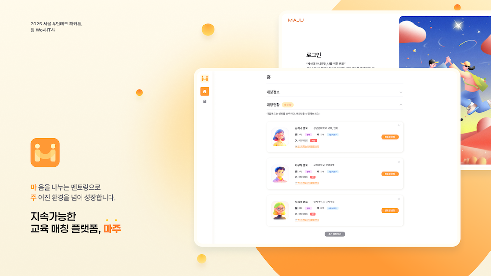

# 🤝 MAJU

<div align="center">
  <h1>MAJU - 맞춤형 멘토링 매칭 서비스</h1>
</div>

<br/>

<div align="center">
  
</div>

<br/>

<div align="center">
  <a href="http://13.125.96.234/login">홈페이지</a>
</div>

<br/>

## 🪢 프로젝트 소개

"마음을 나누는 멘토링으로

주어진 환경을 넘어 성장합니다"
<br><br>

마주(MAJU)는 저소득·한부모 가정 학생도 질 높은 교육과 진로 멘토링을 받을 수 있는

지속가능한 교육 매칭 플랫폼입니다.

<br><br>

## 👭 팀원 소개


|  |  |  |  |  |  
|:-----------------------------------------------------------------------------------------------------------------------------------------:|:-----------------------------------------------------------------------------------------------------------------------------------------:|:------------------------------------------------------------------------------------------------------------------------------------------:|:-----------------------------------------------------------------------------------------------------------------------------------------:|:------------------------------------------------------------------------------------------------------------------------------------------:|
|                                                                 Back-End                                                                 |                                                                 PM/Design                                                                 |                                                                  AI/Back-End                                                                  |                                                                 Front-End                                                                  |                                                                  Back-End                                                                  |Back-End|
|                                                     [채원](https://github.com/offzeroma1)                                                     |                                                   [경서](https://www.instagram.com/starofdesigner?igsh=MXQ3dHB6ZGR6aDQ5NA%3D%3D&utm_source=qr)                                                    |                                                    [태민](https://github.com/therapeuti)                                                     |                                                    [여울](https://github.com/yeowul)                                                     |                                                     [송경](https://github.com/miiiiiin)                                                      |

<br><br>


## 🖥 배포 링크 및 시연 영상

[http://13.125.96.234/login](url)

<br>

### 멘티 시연 영상

[https://www.youtube.com/watch?v=H8pBHxiEEtA](url)


### 멘토 시연 영상

[https://www.youtube.com/watch?v=M6ag4s58rpc](url)
<br><br>

</br>

## 🪄기술 스택

### Front-End
  


### Back-End
  

   

 
<br>

### Production & Deploy
  
<br>
  

### Collaboration tool
 
  
<br/>

## 🔧 Troubleshooting

### 🧑🏻‍💻 백엔드

<details>
<summary>🛠 멘토 매칭 목록 상태 우선순위 정렬 로직 개선</summary>

**Problem & Reason**

- 기존 멘토 매칭 시스템에서는 AI 매칭 점수만을 기준으로 멘토 목록을 정렬하여 제공
- 이로 인해 이미 멘토링 신청이 진행 중인(PENDING) 또는 확정된(CONFIRMED) 멘토가 paging 최초 조회(null)에 없을 때, 매칭 활성화 발생
- 멘티는 1명의 멘토만 신청할 수 있음으로 항상 상태가 있는 멘토가 우선으로 배치되는 개선 필요


**기존 로직 (Before)**
```java
// AI 점수만으로 정렬된 단순 조회
List<MentorCandidateDto> candidates = matchingScores.stream()
    .map(AiMatchingScoreAnalysis::getMentor)
    .map(user -> (Mentor) user)
    .map(mentor -> MentorCandidateDto.from(mentor, 
        getMentoringByMenteeAndMentor(currUser.getId(), mentor.getId()), 
        calculateRelativeFitByMentee(currUser.getId(), mentor.getId())))
    .collect(Collectors.toList());
```

**To Solve**

- 멘토링 상태 기반 우선순위 로직을 추가
- PENDING/CONFIRMED 상태의 멘토링이 존재할 경우 해당 멘토를 최상단에 배치하도록 개선
- 기존 커서 기반 페이지네이션과의 호환성도 고려

**개선된 로직 (After)**
```java
// 1. 우선순위 멘토링 조회 (PENDING/CONFIRMED 상태)
Optional<Mentoring> priorityMentoring = mentoringRepository
    .findByMenteeIdAndStatusIn(currUser.getId(), 
        Arrays.asList(MentoringStatus.PENDING.getStatus(),
                     MentoringStatus.CONFIRMED.getStatus()));

// 2. 상태 기반 정렬 로직 추가
List<MentorCandidateDto> candidates = matchingScores.stream()
    .map(/* 기본 매핑 로직 */)
    .sorted((c1, c2) -> {
        // 멘토링 신청 상태인 멘토를 최상위로 정렬
        boolean c1HasMentoring = MentoringStatus.PENDING.getStatus().equals(c1.status()) ||
                                MentoringStatus.CONFIRMED.getStatus().equals(c1.status());
        boolean c2HasMentoring = MentoringStatus.PENDING.getStatus().equals(c2.status()) ||
                                MentoringStatus.CONFIRMED.getStatus().equals(c2.status());
        
        return Boolean.compare(c2HasMentoring, c1HasMentoring);
    })
    .collect(Collectors.toList());

// 3. 우선순위 멘토가 현재 페이지에 없는 경우 최상단에 삽입
if (priorityMentoring.isPresent()) {
    Mentor priorityMentor = priorityMentoring.get().getMentor();
    
    boolean alreadyIncluded = candidates.stream()
        .anyMatch(c -> c.email().equals(priorityMentor.getEmail()));
        
    if (!alreadyIncluded) {
        // 마지막 항목 제거 후 우선순위 멘토를 최상단에 삽입
        if (!candidates.isEmpty()) {
            candidates.remove(candidates.size() - 1);
        }
        candidates.add(0, MentorCandidateDto.from(priorityMentor, 
            Optional.of(priorityMentoring.get()), 
            calculateRelativeFitByMentee(currUser.getId(), priorityMentor.getId())));
    }
}
```

</details>

### 🛠 배포/서버 관련

<details>
<summary>nginx 프록시를 통한 프론트엔드-백엔드 연결 문제</summary>

**Problem**
- React 프론트엔드에서 백엔드 API로 GET 요청 시 403 오류가 발생하며 요청이 제대로 전달되지 않는 문제

```javascript
// 개발자 도구 콘솔 에러 로그
process.env.REACT_APP_API_BASE_URL: http://localhost:8080

Login error:
   message: 'Network Error'
   name: 'AxiosError'
   code: 'ERR_NETWORK'
   config: {...}
   request: XMLHttpRequest
   
POST http://localhost:8080/api/auths/login
   net::ERR_CONNECTION_REFUSED
   
AxiosError: Network Error
   at g.onerror (http://13.125.96.234/static/js/main.2dd8dfaa.js:2:292464)
   at zr.request
```

**Reason**
Docker로 백엔드 서버를 8080 포트로 실행했는데, 프론트엔드 환경 설정에서 올바른 API 엔드포인트를 설정하지 않음

**To Solve**
- 프론트엔드 `.env` 파일에 `REACT_APP_API_URL=http://[서버IP]:8080` 설정 추가
- nginx 프록시 설정과 Docker 포트 매핑 확인

</details>

<details>
<summary>EC2 프리티어 서버 용량 부족으로 인한 서버 다운</summary>

**Problem**
EC2 프리티어(1GB) 환경에서 서버가 갑자기 접근 불가 상태가 되는 문제 발생.
모니터링 상으로는 CPU 사용률이 50% 이하임에도 불구하고 서버 응답이 없었음.

**Reason**
Docker 컨테이너에서 발생하는 로그가 지속적으로 누적되어 디스크 용량이 가득 참.
EC2 프리티어의 제한된 용량(1GB)에서 Docker 로그가 계속 쌓여 서버 다운 발생.

**To Solve**

1. **Swap Space 설정**으로 메모리 부족 상황 대응
```bash
# 2GB Swap 파일 생성
sudo fallocate -l 2G /swapfile
sudo chmod 600 /swapfile
sudo mkswap /swapfile
sudo swapon /swapfile

# 영구적으로 설정
echo '/swapfile none swap sw 0 0' | sudo tee -a /etc/fstab
```

2. **Docker Compose에 리소스 제한 설정 추가**

**Before: 기존 설정**
```yaml
services:
  database:
    image: mysql:8.0
    command: --default-authentication-plugin=mysql_native_password
    ports:
      - "3306:3306"
    restart: unless-stopped

  backend:
    build:
      context: ./backend
    ports:
      - "8080:8080"
    restart: unless-stopped
```

**After: 용량 관리 설정 추가**
```yaml
services:
  database:
    image: mysql:8.0
    # 🆕 MySQL 메모리 최적화 옵션 추가
    command:
      - --default-authentication-plugin=mysql_native_password
      - --innodb_buffer_pool_size=128M      # RAM 절약
      - --max_connections=100               # 연결 수 제한
    # 🆕 컨테이너 메모리 제한
    mem_limit: 256m
    ports:
      - "3306:3306"
    restart: unless-stopped

  backend:
    build:
      context: ./backend
    # 🆕 메모리 및 로그 제한 설정
    mem_limit: 512m
    logging:
      driver: "json-file"
      options:
        max-size: "50m"
        max-file: "3"
    ports:
      - "8080:8080"
    restart: unless-stopped
```

3. **기존 누적된 Docker 로그 정리**
```bash
# 모든 Docker 로그 및 캐시 정리
docker system prune -a --volumes -f
```

</details>
